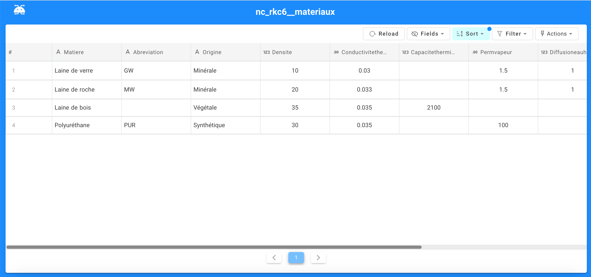
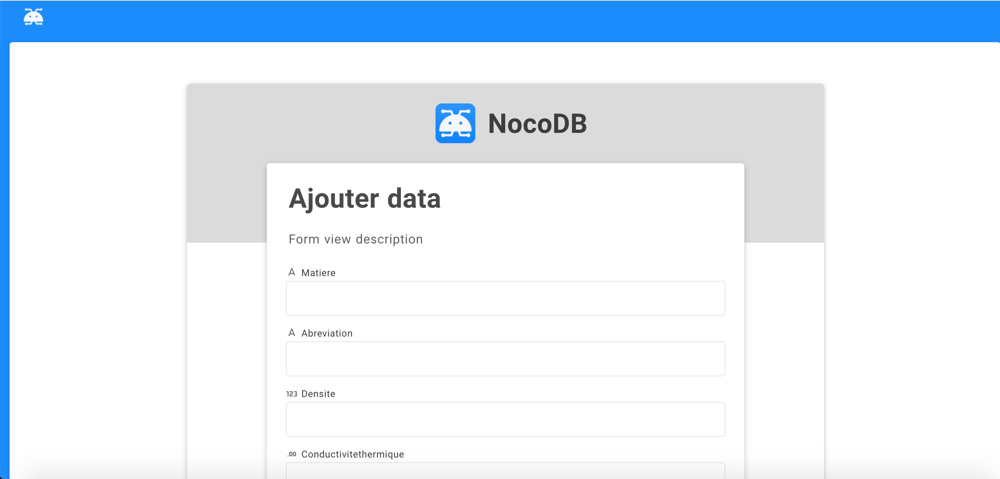
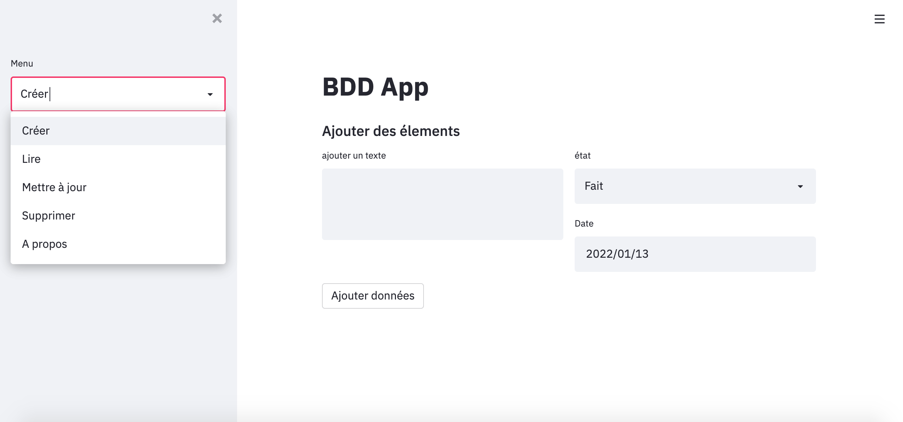

# BDD App
**Création d'une application pour la gestion d'une base de donnée.**

Elements fondamentaux : (CRUD)
- Créer,
- Lire,
- Mettre à Jour,
- Supprimer

**Prototype N°1 : NoCoDB**

Visualisation : 
https://insulatorsdb.herokuapp.com/dashboard/#/nc/view/939be78a-0021-4335-9d2a-afca83e90a3e

Formulaire d'ajout :
https://insulatorsdb.herokuapp.com/dashboard/#/nc/form/c5ea68cb-81ff-4d12-b9df-3a417a613d0a

**Protoype N°2 : Streamlit**

Application Web - Python

